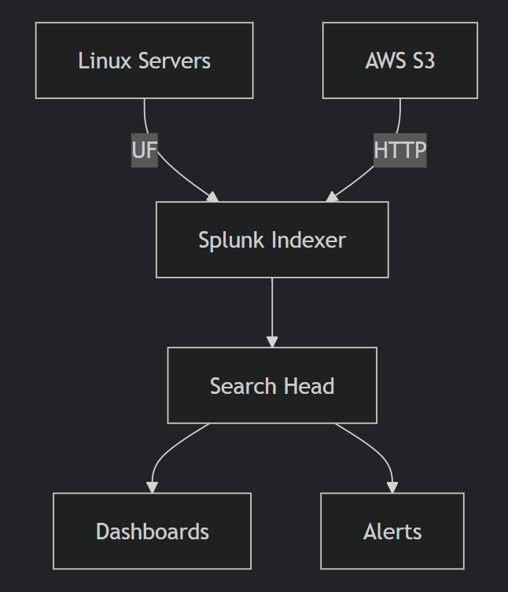

# Splunk Enterprise Deployment with AWS Integration

 

## Project Overview
An end-to-end implementation of Splunk Enterprise for log analysis, featuring:
- **Multi-source log ingestion** (Linux system logs, custom applications)
- **AWS S3 cloud integration** for centralized log storage
- **Distributed architecture** with Universal Forwarders
- **Operational dashboards** and alerting mechanisms

## Key Components Implemented
| Component | Description |
|-----------|-------------|
| **Splunk Indexer** | Central log processing and storage |
| **Universal Forwarder** | Lightweight log collection agents |
| **Search Head** | Interactive data analysis interface |
| **AWS S3 Integration** | Cloud-based log ingestion pipeline |

## Architecture


## Getting Started

### Prerequisites
- Ubuntu 20.04+ server
- AWS account with S3 access
- Splunk Enterprise license (free tier available)

### Installation
```bash
# Download and install Splunk
wget -O splunk-9.1.2.deb "https://download.splunk.com........."
sudo dpkg -i splunk-9.1.2.deb
sudo /opt/splunk/bin/splunk start --accept-license